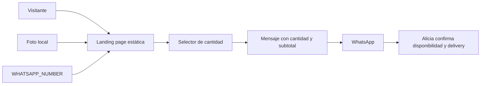

# Arquitectura de Alicia · Comida en casa

La aplicación no usa base de datos, autenticación, carrito persistente ni rutas API. Next.js renderiza la landing y el navegador solo mantiene la cantidad elegida durante la visita.
